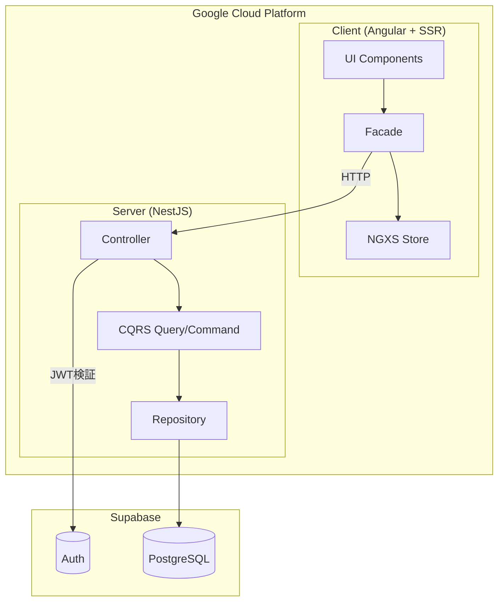

# もとら's dev - Turborepo Monorepo with Angular and NestJS

このプロジェクトは、TurborepoでAngularとNestJSを統合したモダンなモノレポジトリです。技術ブログ「もとら's dev」のソースコードです。

[](https://opensource.org/licenses/MIT)
[](https://nodejs.org/)
[](https://pnpm.io/)
[](https://github.com/motora-dev/motora-dev/actions/workflows/ci-check.yml)
[](https://github.com/motora-dev/motora-dev/actions/workflows/ci-test.yml)
[](https://github.com/motora-dev/motora-dev/actions/workflows/cd-gcp.yml)
[](https://codecov.io/github/motora-dev/motora-dev)

## 🏗 プロジェクト構成

### パッケージ構成

```
motora-dev/
├── apps/                   # アプリケーション
│   ├── client/             # Angular フロントエンドアプリケーション
│   ├── content/            # 記事コンテンツ管理・シード
│   └── server/             # NestJS バックエンドAPI
├── packages/               # 共有パッケージ
│   ├── database/           # Prismaスキーマ・クライアント
│   ├── error-code/         # エラーコード定義
│   ├── eslint-config/      # ESLint設定
│   ├── markdown/           # Markdown処理パッケージ
│   └── typescript-config/  # TypeScript設定
├── terraform/              # GCPインフラ構成（IaC）
├── pnpm-workspace.yaml
├── turbo.json
└── package.json
```

### アプリケーション詳細

#### 📱 Client (`apps/client`)

- **Framework**: [Angular](https://angular.dev/) 21.0.1 + SSR + ISR
- **Styling**: [Tailwind CSS](https://tailwindcss.com/) 4.1.17 + CVA + tailwind-merge
- **State Management**: [NGXS](https://www.ngxs.io/) 20.1.0 + @ngxs/form-plugin
- **Reactive**: [RxAngular](https://www.rx-angular.io/) 20.1.0 + RxJS 7.8.2
- **Testing**: Vitest 4.0.14 + @testing-library/angular + Storybook 10.1.2
- **Linting**: ESLint 9.39.1 (Flat Config)

#### 🚀 Server (`apps/server`)

- **Framework**: [NestJS](https://nestjs.com/) 11.1.9
- **Platform**: Express
- **Testing**: Vitest 4.0.14 + Supertest
- **Linting**: ESLint 9.39.1 (Flat Config)

#### 📝 Content (`apps/content`)

- **用途**: 記事コンテンツ（Markdown）の管理・データベースシード
- **機能**: Markdownファイルからメタデータを読み取り、Prisma経由でデータベースへ投入
- **依存**: @monorepo/database

#### 📦 Shared Packages

- **@monorepo/database**: Prismaスキーマ定義・クライアント生成（User, Article, Page, Mediaモデル）
- **@monorepo/error-code**: エラーコード定義（ドメイン・エンティティ・ステータスコード・メッセージの一元管理）
- **@monorepo/eslint-config**: 共通ESLint設定（TypeScript対応）
- **@monorepo/markdown**: Markdown処理パッケージ（Markdown ↔ ProseMirror変換、Markdown → HTML変換）
- **@monorepo/typescript-config**: 基本TypeScript設定

## 🏛 アーキテクチャ

### システム全体図



### 設計方針

本プロジェクトは **Vertical Slice Architecture** と **Clean Architecture** を組み合わせた構成を採用しています。

#### Vertical Slice Architecture

各機能（ユースケース）を垂直方向にスライスし、独立したモジュールとして実装します。これにより、機能ごとの凝集度が高まり、変更の影響範囲を限定できます。

#### Clean Architecture

依存関係を内側（ドメイン層）から外側（インフラ層）へ向けることで、ビジネスロジックを外部依存から保護します。

### Client / Server 間のドメイン統一

**client と server で同じドメイン名を使用** することで、以下のメリットを得ています：

| ドメイン       | 用途                   | 認証 |
| -------------- | ---------------------- | ---- |
| `article-list` | 記事一覧の取得・表示   | 不要 |
| `article-page` | 記事ページの取得・表示 | 不要 |
| `article-edit` | 記事・ページの編集     | 必要 |

**メリット:**

- **認知負荷の軽減**: フロントエンドとバックエンドで同じ名前を使うことで、どのAPIがどの画面に対応するか一目瞭然
- **ドメイン境界の明確化**: 機能ごとに独立したモジュールとなり、責務が明確

**デメリット:**

- **コードの重複**: DDD を重視しドメイン境界を明確化するため、似たようなコード（DTO、モデル、リポジトリ等）が複数ドメインに存在することがある。例えば `article-page`（閲覧用）と `article-edit`（編集用）で類似のページ取得ロジックが必要な場合でも、認証要件の違いから別々に実装する

### 詳細ドキュメント

各アプリケーションの詳細な設計・アーキテクチャについては、それぞれの README を参照してください：

- [Client README](apps/client/README.md) - Facade パターン、NGXS 状態管理、UI アーキテクチャ
- [Server README](apps/server/README.md) - CQRS パターン、Repository パターン、認証・認可
- [Terraform README](terraform/README.md) - GCP インフラ構成（IAM、Workload Identity Federation）

## 🛠 技術スタック

- **Package Manager**: [pnpm](https://pnpm.io/) 10.24.0 (ワークスペース機能使用)
- **Build System**: [Turborepo](https://turbo.build/repo) 2.6.0
- **Language**: [TypeScript](https://www.typescriptlang.org/) 5.9.3
- **Code Quality**: ESLint 9.39.1 + Prettier 3.7.3
- **Testing**: Vitest 4.0.14 + Testing Library
- **Module System**: ES Modules (`"type": "module"`)

## 🚀 開発環境のセットアップ

### 必要な環境

- Node.js 24.11.0（推奨）
- pnpm 10.24.0

### Voltaのセットアップ（推奨）

このプロジェクトでは[Volta](https://volta.sh/)を使用してNode.jsとpnpmのバージョンを自動管理しています。

```bash
# Voltaがインストールされていない場合
# macOS / Linux
curl https://get.volta.sh | bash

# Windows
# https://docs.volta.sh/guide/getting-started を参照
```

#### pnpmサポートの有効化

Voltaのpnpmサポートは現在実験的な機能です。有効にするには、環境変数`VOLTA_FEATURE_PNPM`を設定する必要があります。

**macOS / Linuxの場合：**

シェルプロファイルファイル（`.zshrc`、`.bash_profile`など）に以下を追加：

```bash
export VOLTA_FEATURE_PNPM=1
```

設定を反映：

```bash
# zshの場合
source ~/.zshrc

# bashの場合
source ~/.bash_profile
```

**Windowsの場合：**

システム環境変数として`VOLTA_FEATURE_PNPM`を`1`に設定してください（システム設定 > 環境変数）。

```bash
# プロジェクトディレクトリに移動すると、Voltaが自動的に
# package.jsonの設定に基づいてNode.js 24.11.0とpnpm 10.24.0を切り替えます
```

> **注意**: Voltaのpnpmサポートは実験的な機能です。詳細は[公式ドキュメント](https://docs.volta.sh/advanced/pnpm)を参照してください。

Voltaを使用することで、プロジェクトごとに適切なバージョンが自動的に設定され、バージョンの不整合を防げます。

### インストール

```bash
# 依存関係のインストール
pnpm install
```

### 開発サーバーの起動

```bash
# 全アプリケーションを起動
pnpm start

# 個別に起動
pnpm start --filter=@monorepo/client    # Angular (http://localhost:4200)
pnpm start --filter=@monorepo/server    # NestJS (http://localhost:4000)

# Storybookの起動（Clientのみ）
pnpm storybook --filter=@monorepo/client    # Storybook (http://localhost:6006)
```

> **注意**: `pnpm xxx --filter=yyy` の形式を使用することで、Turborepoの依存関係グラフが適用され、依存パッケージのビルドが自動実行されます。`pnpm --filter=yyy xxx` の形式では依存関係が無視されます。

## 📝 利用可能なコマンド

### 全体コマンド（ルートディレクトリで実行）

```bash
# 完全クリーンアップ（node_modulesも削除 + pnpm store prune）
pnpm clean

# キャッシュクリア（node_modules保持）
pnpm clean:cache

# 開発サーバー起動（全パッケージ）
pnpm start

# 本番モード起動（全パッケージ）
pnpm start:prd

# ビルド（全パッケージ）
pnpm build

# TypeScript型チェック（全パッケージ）
pnpm tsc

# テスト実行（全パッケージ）
pnpm test

# カバレッジ付きテスト（全パッケージ）
pnpm test:coverage

# リント実行（全パッケージ）
pnpm lint

# リント自動修正（全パッケージ）
pnpm lint:fix

# フォーマットチェック（全パッケージ）
pnpm format

# フォーマット自動修正（全パッケージ）
pnpm format:fix

# 全チェック（型チェック、フォーマット、リント、ビルド、テスト）
pnpm check-all
```

### Client固有のコマンド

```bash
# TypeScript型チェック（ビルド用）
pnpm tsc:build --filter=@monorepo/client

# TypeScript型チェック（テストコード）
pnpm tsc:test --filter=@monorepo/client

# Storybookの起動
pnpm storybook --filter=@monorepo/client

# Storybookのビルド
pnpm build-storybook --filter=@monorepo/client
```

### lint-staged設定

コミット時に自動で以下が実行されます：

- TypeScriptの型チェック（ソースとテストで別々の設定）
- Prettierによるコードフォーマット
- ESLintによるリント

## 🧪 テスト

### テストの実行

```bash
# 全テストを実行
pnpm test

# カバレッジ付きで実行
pnpm test:coverage

# 特定パッケージのテスト
pnpm test --filter=@monorepo/client
pnpm test --filter=@monorepo/server
```

### テスト環境の特徴

- **Client**:
  - Vitest + @testing-library/angular（コンポーネントテスト）
  - Storybook（UIカタログ・ドキュメント）
- **Server**: E2Eテスト対応（Supertest使用）
- **共通**: `tsconfig.spec.json`による厳密な型チェック

## 📦 主要な依存関係

### 共通


### Client


### Server


## 🔄 CI/CD パイプライン

GitHub Actions による自動化されたパイプラインを構築しています。

### CI（継続的インテグレーション）

| ワークフロー               | トリガー                | 内容                            |
| -------------------------- | ----------------------- | ------------------------------- |
| **Check** (`ci-check.yml`) | PR・Push (develop/main) | Format, Lint, Build, 型チェック |
| **Test** (`ci-test.yml`)   | PR・Push (develop/main) | 変更検知付きテスト + カバレッジ |

### CD（継続的デリバリー）

| ワークフロー                     | トリガー            | 内容                             |
| -------------------------------- | ------------------- | -------------------------------- |
| **Deploy to GCP** (`cd-gcp.yml`) | Push (develop/main) | Cloud Build + Cloud Run デプロイ |
| **Preview** (`cd-preview.yml`)   | PR (develop)        | プレビュー環境へのデプロイ       |
| **Database** (`cd-database.yml`) | 手動                | データベースマイグレーション     |

### 特徴

- **変更検知**: `tj-actions/changed-files` により、変更があったパッケージのみテスト・デプロイ
- **Workload Identity Federation**: サービスアカウントキーを使わない安全な認証
- **環境分離**: develop/main ブランチで異なる環境にデプロイ

## 🏃 開発フロー

1. フィーチャーブランチを作成
2. 変更を実装
3. テストを書く・実行する（`pnpm test`）
4. `pnpm check-all`で全チェック（型チェック、フォーマット、リント、ビルド、テスト）
5. コミット（lint-stagedが自動実行）
6. プルリクエストを作成
